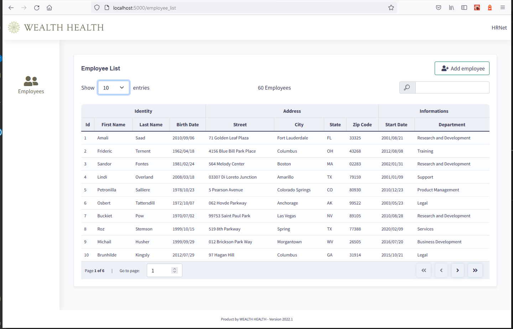

# WealthHealth - HRnet
   Projet fictif de formation n°14/14 | OpenClassrooms
 
# Lien du projet en ligne
  <a href="https://fz-hrnet.netlify.app/">fz-hrnet.netlify.app</a>

 > PROBLEMATIQUE

 HRnet à lui seul représente environ 90% de la dette technologique totale.Elle utilise  jQuery côté front end, ce qui entraîne des bugs et rend le système mois performant et instable.

 

> BESOINS

- Convertir l'ensemble du projet HRNet en React. 
- Convertir l'un des quatre plugins jQuery actuels    en  React. 
- Remplacer les 3 plugins jQuery restants par des  composants React, à savoir:
  - Sélecteur de date
  - Fenêtre modale
  - Menus déroulants
  - Tables de données
- Effectuer des tests de performance Lighthouse en comparant l'ancienne et la nouvelle application. 
- Réaliser des tests e2e
- Mettre en forme avec un design moderne

## Compétences développées

- [x] Refactorer un ancien code "jQuery" en utilisant les nouvelles technologies et les nouveaux modèles "React"
- [x] Créer un composant React et le publier sous forme de package  sur npm
- [x] Analyser la performance d'une application web à l'aide de "LightHouse"

## Bibliothèques

- React
- react-hook-form
- react-redux
- reactmodalfz
- Datepicker
- moment
- yup
- react-table
- Bootsrap

## Outils
* Visual Studio Code
* Prettier
* esLinter
* Cypress

## Installation
- npm install or yarn install
  
## Lancement du projet
- npm start or yarn start
  
## Lancement des tests cypress/e2e
- npm run cypress

